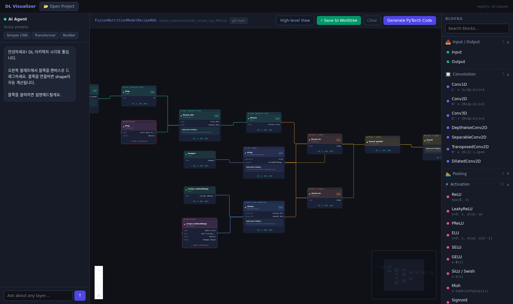
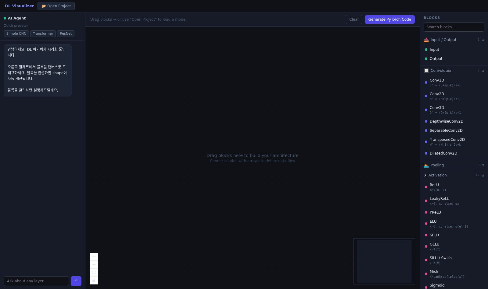
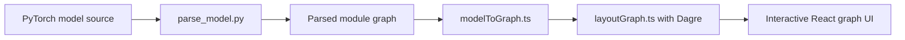

# See Through Deep Learning

See Through Deep Learning is a research-oriented tool for inspecting PyTorch model code as a visual graph. It focuses on static structure and data-flow tracing, so you can read branching, fusion, masking, and custom modules without stepping through the model manually.

The current application lives in `dl-visualizer/`. It combines a React-based graph UI with a lightweight server and a Python parser that extracts module structure from model source files.

## Visual Overview

<p align="center">
  
</p>

This screenshot shows the real application rendering `FusionNutritionModelRecipeRAG` from `recipe_adamine/model_recipe_rag_RNS.py` in high-level view.

## Demo

<p align="center">
  
</p>

## How It Works



## What You See

- Top-level module structure and branch flow
- Static tensor routing such as fusion, masking, and merge points
- Expandable submodules for deeper inspection without losing the overall pipeline

## Why This Repository

- Visualize PyTorch model structure from source code
- Trace branches and tensor flow more clearly than raw Python alone
- Inspect custom modules without relying on runtime graph export

## Repository Layout

- `dl-visualizer/`: frontend, parser, and local server
- `AGENTS.md`: contributor guidance for AI-assisted work

## Quick Start

```bash
cd dl-visualizer
npm install
npm run dev
```

For the local API server:

```bash
cd dl-visualizer
npm start
```

## Suggested GitHub Description

Static visualization of PyTorch model structure and data flow for research and debugging.
